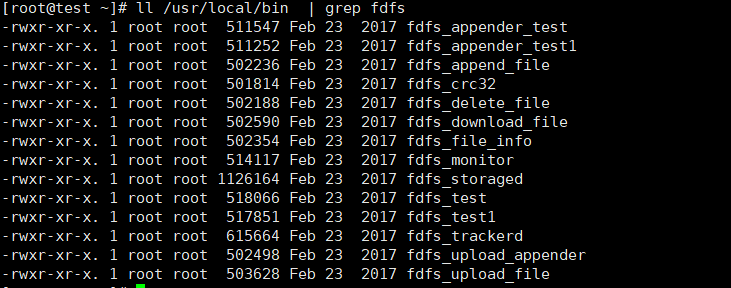

# fastdfs常见管理

### 文件操作




### 一般操作如下

```bash
vim /etc/fdfs/client.conf
```

```config
#base_path=/fdfs/tracker                    #日志存放路径
#tracker_server=192.168.0.1:22122          #tracker服务器IP地址和端口号
#http.tracker_server_port=8088              #tracker服务器的http端口号
```

```bash
#上传
/usr/bin/fdfs_upload_file /etc/fdfs/client.conf  /temp/G_success.jpg

# 其他，看具体命令

```

